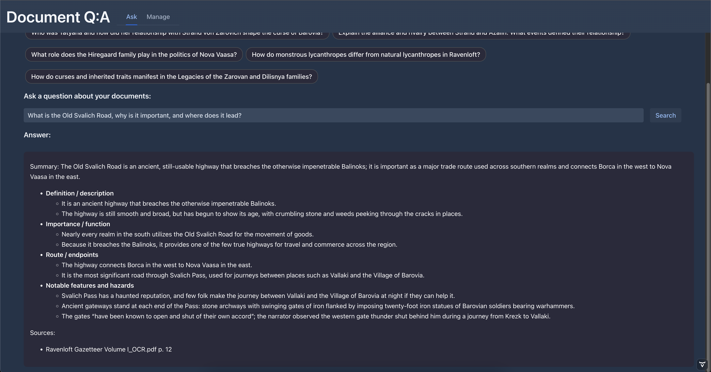
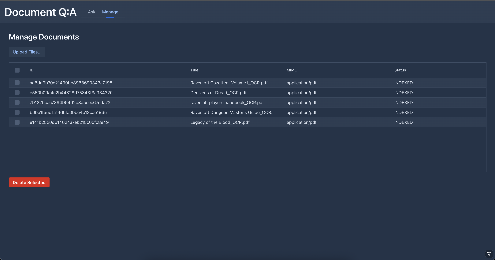

# doc-qa
Document Q:›A system built in pure Java

> **Summary**  
> **doc-qa** is an **Document Q&A system** built in pure Java.  
> It implements a **Retrieval-Augmented Generation (RAG)** pipeline, which works in three main steps:
>
> 1. **Embedding** – Documents are split into passages and converted into multilingual dense vectors using an ONNX embedding model.
> 2. **Retrieval & Reranking** – Relevant passages are fetched with hybrid (semantic + keyword) search in Lucene and reranked by a multilingual cross-encoder for precision.
> 3. **Answering** – The top-ranked passages are distilled into a faithful, cited **HTML answer** by a reasoning model.
>
> This guarantees that answers are **grounded in your documents**: retrieval ensures coverage, reranking ensures precision, and the answer generator provides a natural explanation with citations.

---

## Screenshots

<p float="left">
  
  
</p>

## How it works

At its core, `doc-qa` turns your documents into searchable knowledge and connects them to an AI reasoning service. The flow looks like this:

1. **Document ingestion**
    - Documents (PDF, DOCX, HTML, …) are parsed (`TextExtractor`), then broken into smaller chunks (`Chunk`).
    - Chunks carry metadata like `docId` and page ranges.

2. **Embedding & indexing**
    - Each chunk is embedded into a dense vector (`OnnxEmbeddingService`) using an exported HuggingFace ONNX model (e.g. `intfloat/multilingual-e5-large`).
    - Chunks and vectors are stored together in a Lucene index (`LuceneVectorIndexService`), which supports both BM25 keyword search and HNSW vector search.

3. **Retrieval**
    - A user query is embedded into a vector.
    - The query runs against Lucene in two ways:
        - **Vector search** (`KnnFloatVectorQuery`)
        - **Keyword search** (BM25)
    - Results are fused by score weighting inside `HybridRetrieverService`.

4. **Reranking**
    - The top candidate passages are reranked with a cross-encoder model (`OnnxRerankService`, e.g. `jina-reranker-v2-base-multilingual`).
    - Query + passage pairs are scored, using sliding windows to handle long passages.
    - Passages are sorted by their relevance scores.

5. **Answer generation**
    - The top reranked passages are converted into citations (`CitationResolverService`).
    - A reasoning model (`AnswerService` with Spring AI `ChatModel`) receives the user query and reranked passages.
    - The model generates a structured **HTML answer** containing:
        - a concise summary
        - bullet-point evidence
        - a “Sources” section linking to original documents/pages

6. **Orchestration**
    - The entire pipeline is coordinated by `QueryManager`.
    - Each user question is processed as a `QuestionJob`, which passes through states: `RETRIEVING → RERANKING → ANSWERING → COMPLETED`.

---

## Typical data flow
```
User Question
↓
QueryManager
↓
HybridRetrieverService (BM25 + HNSW)
↓
OnnxRerankService (cross-encoder reranker)
↓
CitationResolverService
↓
AnswerService (ChatModel → HTML with sources)
```


---

## Models

Models are loaded from a user-home directory: `${user.home}/.docqa/models/`

### Embedding model
- Model: `intfloat/multilingual-e5-large` (ONNX)
- Files:
    - `${user.home}/.docqa/models/retriever/model.onnx`
    - `${user.home}/.docqa/models/retriever/tokenizer.json`

### Reranker model
- Model: `jinaai/jina-reranker-v2-base-multilingual` (ONNX)
- Files:
    - `${user.home}/.docqa/models/reranker/model.onnx`
    - `${user.home}/.docqa/models/reranker/tokenizer.json`

### Answering model
- Any Spring AI-compatible `ChatModel` (local Ollama, OpenAI, etc.)
- Currently using **GPT-5-mini**

---

## Model setup

Before running the application, you need to download the embedding and reranker models.  
A helper script is provided:

```bash
./download-models.sh
```

This will:

- Create the directories ${user.home}/.docqa/models/retriever and ${user.home}/.docqa/models/reranker.
- Download the ONNX model and tokenizer files from the configured URLs.
- Verify their checksums before storing them.

After running the script, you should have:
```
~/.docqa/models/retriever/model.onnx
~/.docqa/models/retriever/model.onnx_data
~/.docqa/models/retriever/tokenizer.json

~/.docqa/models/reranker/model.onnx
~/.docqa/models/reranker/tokenizer.json
```
---

## Development notes

- **Consistency:** Lucene requires all vectors in one index to have the same dimension. If you change embedding models, you must reindex.
- **Windowing:** The reranker splits long passages into overlapping windows to avoid truncation bias.
- **Fusion weights:** Retrieval scoring balance (vector vs. keyword) is tunable in `HybridRetrieverService`.
- **API key:** You must set your OpenAI API key as a **VM argument** when running the application:
  ```bash
  -Dspring.ai.openai.api-key=sk-xxxxxx
---

